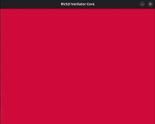
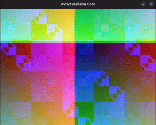
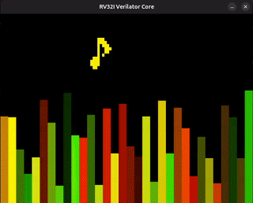
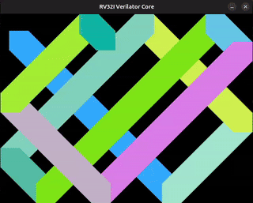

# RISC-V Applications 🎮

Use these applications to demonstrate the capabilities of the RV32I Processor. They are written in RISC-V Assembly and interact with the processor's memory-mapped I/O.

## 🗺️ Memory Map

The processor uses a specific memory map to interact with the display peripheral.

| Region | Start Address | End Address | Description |
|--------|---------------|-------------|-------------|
| **VRAM** | `0x00008000` | `0x00053000` | Video Memory (320x240 pixels). Each 4 bytes map to a pixel (32-bit ARGB). |
| **Control**| `0x00054000` | - | Refresh Trigger. Writing to this address forces a frame update. |

> **Note:** The applications simply write to these addresses using `SB` (Store Byte) or `SW` (Store Word) instructions. The C++ Simulation wrapper captures these writes via DPI to render the graphics window.

## Available Demos

### 1. `colors.s`
**Purpose**: System Verification (VRAM).
*   **Visual**: Cycles through full-screen colors (Red, Green, Blue increments).
*   **Logic**: Fills the entire VRAM buffer with a single color, then updates the color value for the next frame. Checks write throughput. (Verified VRAM Bandwidth)
    
    
    > 🎥 [Watch High-Res](../docs/videos/colors.mp4)

### 2. `xor_patterns.s`
**Purpose**: Coordinate Mapping & Logic Ops.
*   **Visual**: Colorful fractal patterns generated by bitwise logic.
*   **Logic**: `Color = (X ^ Y) | Frame_Counter`. Demonstrates how simple logic operations can create complex visual textures.
*   **Logic**: `Color = (X ^ Y) | Frame_Counter`. Demonstrates how simple logic operations can create complex visual textures.
    
    
    > 🎥 [Watch High-Res](../docs/videos/xor_patterns.mp4)

### 3. `dream.s` (Formerly `palette_wave.s`)
**Purpose**: Advanced Graphics & Optimization.
*   **Visual**: A chaotic, flowing plasma effect with independent R/G/B channel flows and alpha fluctuation.
*   **Logic**: Uses 2x2 block rendering for performance optimization (simulating lower resolution). Avoids XOR artifacts by using smooth triangle waves.
*   **Logic**: Uses 2x2 block rendering for performance optimization (simulating lower resolution). Avoids XOR artifacts by using smooth triangle waves.
    
    
    > 🎥 [Watch High-Res](../docs/videos/dream.mp4)

### 4. `audio_bars.s`
**Purpose**: Complex Logic & Interactive Simulation.
*   **Origin**: Originally designed for an **ARM Cortex M0** processor in the **Microprocessor Systems** course.
*   **Logic**: Simulates an audio spectrum analyzer with pseudorandomly changing bar heights and colors.
*   **Logic**: Simulates an audio spectrum analyzer with pseudorandomly changing bar heights and colors.
    
    
    > 🎥 [Watch High-Res](../docs/videos/audio_bars.mp4)

### 5. `bouncing_square.s`
**Purpose**: Basic Physics & Collision.
*   **Origin**: This work was inspired by a Microprocessor Systems term project developed by my colleagues Fatih Siyah and Kerem Şen for ARM Cortex-M0. The original idea was a bouncing square that changes color on wall collisions, much like a DVD screensaver. During development, however, the screen refresh was accidentally omitted, producing a permanent trail effect. Interestingly, this “bug” turned out to be far more visually appealing than the intended behavior. (By the way, the square hits the corner, do not worry) 🙂
*   **Visual**: A configurable square (default 25px) that changes color upon wall collision.
*   **Logic**: Physics updates, boundary checking (`SQ_SIZE` configurable), collision-based color changes.
    
    
    > 🎥 [Watch High-Res](../docs/videos/bouncing_square.mp4)

## Running Applications

Use the CLI to run these apps (GUI auto-launches if VRAM is used):

```bash
# Run Dream (Plasma)
./runner.py run app/dream.s

# Run Bouncing Square
./runner.py run app/bouncing_square.s
```
